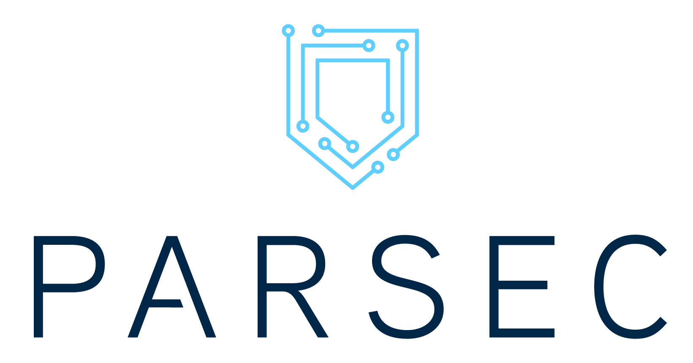

<!--
  -- Copyright 2021 Contributors to the Parsec project.
  -- SPDX-License-Identifier: Apache-2.0

  --
  -- Licensed under the Apache License, Version 2.0 (the "License"); you may
  -- not use this file except in compliance with the License.
  -- You may obtain a copy of the License at
  --
  -- http://www.apache.org/licenses/LICENSE-2.0
  --
  -- Unless required by applicable law or agreed to in writing, software
  -- distributed under the License is distributed on an "AS IS" BASIS, WITHOUT
  -- WARRANTIES OR CONDITIONS OF ANY KIND, either express or implied.
  -- See the License for the specific language governing permissions and
  -- limitations under the License.
--->


# PARSEC Go Client

This repository contains a PARSEC Go Client library.
The library contains methods to communicate using the [wire protocol](https://parallaxsecond.github.io/parsec-book/parsec_client/wire_protocol.html).

**Warning** The current status of this interface is suitable only for review of the API.  It is a work in progress.  There are ommissions and testing is very minimal at this stage.

# Usage

Sample usage can be found in the end to end tests in the [e2etest folder](./e2etest)

# Parsec Interface Version

The parsec interface is defined in google protocol buffers .proto files, included in the [parsec operations](https://github.com/parallaxsecond/parsec-operations), which is included as a git submodule in the [/parsec-operations](./parsec-operations) folder in this repository.  This submodule is currently pinned to parsec-operations v0.6.0

The protocol buffers files are used to [generate translation golang code](./interface/operations) which is checked into this repository to remove the requirement for developers *using* this library to install protoc.

To update the generated files, run the following in this folder (protoc and make required)

```
make clean-protoc
make protoc
make build
```

# Testing

To run unit tests:

```
make test
```

To run continuous integration tests (requires docker).  This will run up docker container that will run the parsec daemon and then run a series of end to end tests.  

``` 
make ci-test-all
```

All code for the end to end tests is in the [e2etests](./e2etests) folder.

Black box unit tests for folders are found in a test folder under the main package folder (e.g. for algorithm [algorithm/test](./algorithm/test))

Internal tests for packages will be in the relevant package folders as required by go, and will be called xxx_internal_test.go

# Folder Structure

- [This folder](./) General files that must be at the top level - readmes, licence, lint configurations, etc.
- [.github/workflows](./.github/workflows) Github Build CI action definitions - CI testing, build, unit test, static analysis...
- [e2etest](./e2etest) End to End testing - Docker containers to fire up parsec and run end to end tests.  Also used in CI end to end testing.
- [interface](./interface) The Google Protocol Buffers basic client for communicating with the parsec daemon.  This provides the underlying interface to parsec, but is not intended for client application use.
- [parsec](./parsec) This is the public interface of the Parsec Go client.

# License

The software is provided under Apache-2.0. Contributions to this project are accepted under the same license.

This project uses the following third party libraries:
golang.org/x/sys BSD-3-Clause
google.golang.org/protobuf BSD-3-Clause
github.com/sirupsen/logrus MIT


# Contributing

Please check the [Contributing](CONTRIBUTING.md) to know more about the contribution process.
